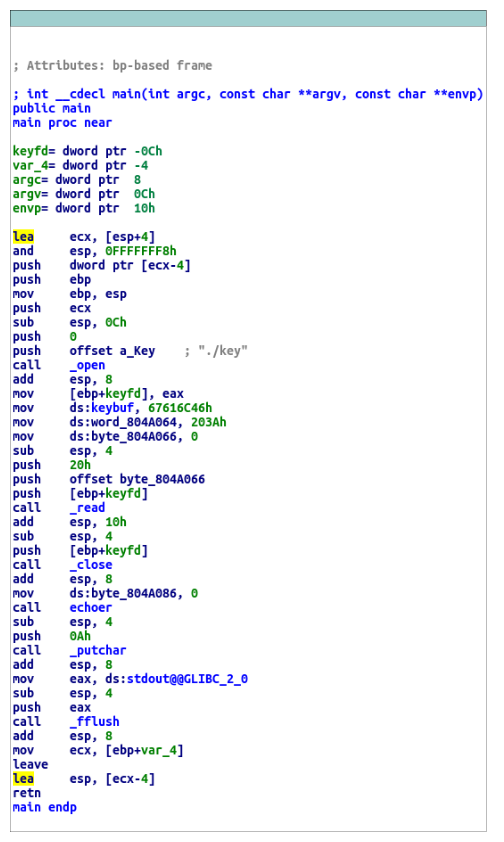
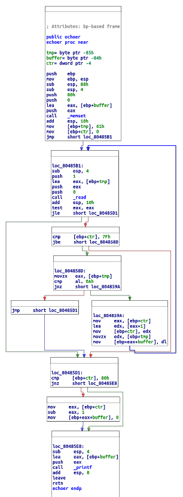

## YAFSP [100]
**Tags**: 

**Description**: A vulnerable service is running at `shell.cyberstakesonline.com:3680`. Leak the key from memory. The binary is available at `/home/problems/63f02e58b636d84c2f9ebf187b63485d/yafsp_6` on the shell server, or for download at [yafsp](yafsp).

## Solution
**WORK IN PROGRESS**

Disassembly of `main()` and `echoer()` in IDA:

 