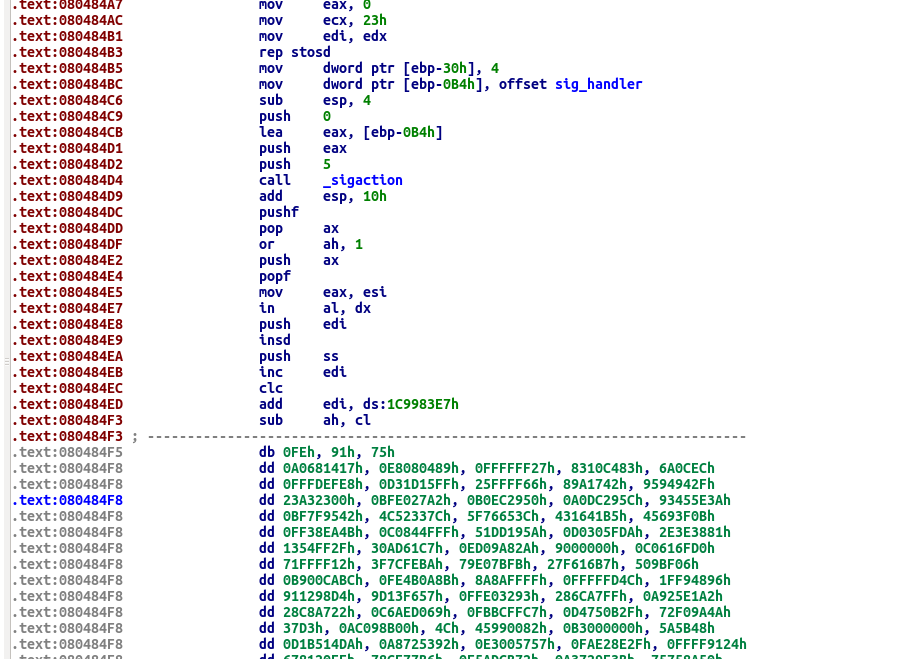
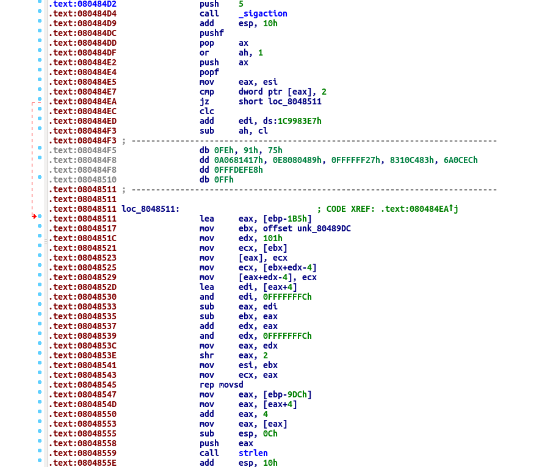
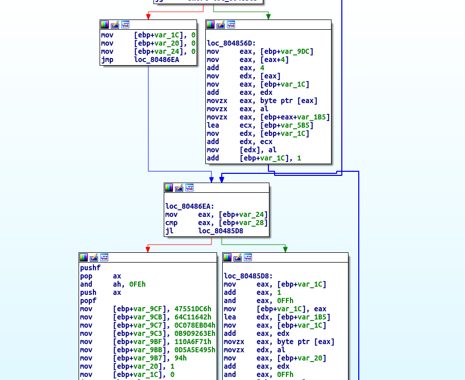

## TRAPPED 1 [200]
Well, shoot. It looks like you're back here, [trapped](trapped1) once more.  
**Hint:** Some thoughtful static analysis might be good here.

## Part 1: Deobfuscating the Code
Loading this binary in IDA, we see that it was unable to cleanly disassemble all of the code starting around `0x080484e5`:



The first thing the binary does is zero out a `struct sigaction` on the `main()` stack, set some of its elements, and call `sigaction()` for signal number 5 (`#define`d in `/usr/include/bits/signum.h` as `SIGTRAP`.), Accoring to the `man` page, `sigaction()` is used to "change the action taken by a process on receipt of a specific signal." The function prototype for `sigaction()` is:
```C
int sigaction(int signum, const struct sigaction *act, struct sigaction *oldact);
```

We can do some investigation of the `struct sigaction` definition in `/usr/include/bits/sigaction.h` to calculate element offsets and determine which elements `main()` was actually setting based on its `ebp` references. The following x86 instructions:
```
.text:080484A1                 lea     edx, [ebp-0B4h]
.text:080484A7                 mov     eax, 0
.text:080484AC                 mov     ecx, 23h
.text:080484B1                 mov     edi, edx
.text:080484B3                 rep stosd
.text:080484B5                 mov     dword ptr [ebp-30h], 4
.text:080484BC                 mov     dword ptr [ebp-0B4h], offset sig_handler
.text:080484C6                 sub     esp, 4
.text:080484C9                 push    0
.text:080484CB                 lea     eax, [ebp-0B4h]
.text:080484D1                 push    eax
.text:080484D2                 push    5
.text:080484D4                 call    _sigaction
.text:080484D9                 add     esp, 10h
```

... are roughly the assembly of the following C code:
```C
struct sigaction sigact;
memset(&sigact, 0, sizeof(struct sigaction));
sigact->sa_flags = SA_SIGINFO; // #define SA_SIGINFO 4
sigact->sa_handler = sig_handler;
    
sigaction(SIGTRAP, &sigact, NULL); // #define SIGTRAP 5
```

`SA_SIGINFO` is a flag for `.sa_flags` which specifies that the signal handler function `.sa_handler` will take three arguments instead of the default one argument. **This will be important later.** The `SIGTRAP` signal is used mostly by debuggers to pause execution and allow a user to examine and set memory/registers.

Bit #8 of the x86 `FLAGS` register is called the "trap flag" (`TF` for short). If this bit is set, the CPU will "single-step" through instructions, raising a `SIGTRAP` before executing each instruction that can be hooked by a debugger like `gdb`. After setting the custom signal handler for `SIGTRAP`, the binary executes the following instructions:
```
.text:080484DC                 pushf
.text:080484DD                 pop     ax
.text:080484DF                 or      ah, 1
.text:080484E2                 push    ax
.text:080484E4                 popf
```

x86 does not contain instructions for explicitly settng all of the bits in `FLAGS`: in order to create a custom `FLAGS` register state, one must push the `FLAGS` register onto the normal call stack with `pushf`, pop it into a general purpose register, modify its value as necessary (usually with a bitmask), push it back onto the call stack, and then pop the new value back into the `FLAGS` register with `popf`. In this case, the binary sets the trap flag (bit #8 in `ax` or bit #0 in `ah`) After this new state is popped back into the `FLAGS` register, it will begin single-stepping through instructions, calling the custom signal handler `sig_handler()` before **every single instruction!**

Now let's take a look at `sig_handler()` disassembly:
```
.text:080487BD ; =============== S U B R O U T I N E =======================================
.text:080487BD
.text:080487BD ; Attributes: bp-based frame
.text:080487BD
.text:080487BD                 public sig_handler
.text:080487BD sig_handler     proc near               ; DATA XREF: .text:080484BCo
.text:080487BD
.text:080487BD arg_8         = dword ptr  10h
.text:080487BD
.text:080487BD                 push    ebp
.text:080487BE                 mov     ebp, esp
.text:080487C0                 mov     eax, ds:prev_loc
.text:080487C5                 test    eax, eax
.text:080487C7                 jz      loc_804884D
.text:080487CD
.text:080487CD                 mov     eax, ds:prev_loc
.text:080487D2                 mov     edx, ds:prev_loc
.text:080487D8                 movzx   ecx, byte ptr [edx]
.text:080487DB                 movzx   edx, ds:prev_val
.text:080487E2                 xor     edx, ecx
.text:080487E4                 mov     [eax], dl
.text:080487E6                 mov     eax, ds:prev_loc
.text:080487EB                 add     eax, 1
.text:080487EE                 mov     edx, ds:prev_loc
.text:080487F4                 add     edx, 1
.text:080487F7                 movzx   ecx, byte ptr [edx]
.text:080487FA                 movzx   edx, ds:prev_val
.text:08048801                 xor     edx, ecx
.text:08048803                 mov     [eax], dl
.text:08048805                 mov     eax, ds:prev_loc
.text:0804880A                 add     eax, 2
.text:0804880D                 mov     edx, ds:prev_loc
.text:08048813                 add     edx, 2
.text:08048816                 movzx   ecx, byte ptr [edx]
.text:08048819                 movzx   edx, ds:prev_val
.text:08048820                 xor     edx, ecx
.text:08048822                 mov     [eax], dl
.text:08048824                 mov     eax, ds:prev_loc
.text:08048829                 add     eax, 3
.text:0804882C                 mov     edx, ds:prev_loc
.text:08048832                 add     edx, 3
.text:08048835                 movzx   ecx, byte ptr [edx]
.text:08048838                 movzx   edx, ds:prev_val
.text:0804883F                 xor     edx, ecx
.text:08048841                 mov     [eax], dl
.text:08048843                 mov     ds:prev_loc, 0
.text:0804884D
.text:0804884D loc_804884D:                            ; CODE XREF: sig_handler+Aj
.text:0804884D                 mov     eax, [ebp+arg_8]
.text:08048850                 mov     eax, [eax+4Ch]
.text:08048853                 and     eax, 0FF000000h
.text:08048858                 cmp     eax, 8000000h
.text:0804885D                 jnz     loc_804890E
.text:08048863                 mov     eax, [ebp+ucontext]
.text:08048866                 mov     eax, [eax+4Ch]
.text:08048869                 mov     ds:prev_loc, eax
.text:0804886E                 mov     eax, ds:prev_loc
.text:08048873                 mov     edx, eax
.text:08048875                 mov     eax, ds:prev_loc
.text:0804887A                 shr     eax, 8
.text:0804887D                 xor     edx, eax
.text:0804887F                 mov     eax, ds:prev_loc
.text:08048884                 shr     eax, 10h
.text:08048887                 xor     edx, eax
.text:08048889                 mov     eax, ds:prev_loc
.text:0804888E                 shr     eax, 18h
.text:08048891                 xor     eax, edx
.text:08048893                 mov     ds:prev_val, al
.text:08048898                 mov     eax, ds:prev_loc
.text:0804889D                 mov     edx, ds:prev_loc
.text:080488A3                 movzx   ecx, byte ptr [edx]
.text:080488A6                 movzx   edx, ds:prev_val
.text:080488AD                 xor     edx, ecx
.text:080488AF                 mov     [eax], dl
.text:080488B1                 mov     eax, ds:prev_loc
.text:080488B6                 add     eax, 1
.text:080488B9                 mov     edx, ds:prev_loc
.text:080488BF                 add     edx, 1
.text:080488C2                 movzx   ecx, byte ptr [edx]
.text:080488C5                 movzx   edx, ds:prev_val
.text:080488CC                 xor     edx, ecx
.text:080488CE                 mov     [eax], dl
.text:080488D0                 mov     eax, ds:prev_loc
.text:080488D5                 add     eax, 2
.text:080488D8                 mov     edx, ds:prev_loc
.text:080488DE                 add     edx, 2
.text:080488E1                 movzx   ecx, byte ptr [edx]
.text:080488E4                 movzx   edx, ds:prev_val
.text:080488EB                 xor     edx, ecx
.text:080488ED                 mov     [eax], dl
.text:080488EF                 mov     eax, ds:prev_loc
.text:080488F4                 add     eax, 3
.text:080488F7                 mov     edx, ds:prev_loc
.text:080488FD                 add     edx, 3
.text:08048900                 movzx   ecx, byte ptr [edx]
.text:08048903                 movzx   edx, ds:prev_val
.text:0804890A                 xor     edx, ecx
.text:0804890C                 mov     [eax], dl
.text:0804890E
.text:0804890E loc_804890E:                            ; CODE XREF: sig_handler+A0j
.text:0804890E                 pop     ebp
.text:0804890F                 retn
.text:0804890F sig_handler     endp
.text:0804890F
```
The `sig_handler()` function references two global variables `prev_loc` and `prev_val`, as well as one argument to the function at `[ebp+0x10]`. Since this binary is using the standard 32-bit CDECL calling convention, we know that arguments are passed right to left onto the stack and once the function prologue has finshed executing, the arguments will be at `[ebp+0x8]`, `[ebp+0xC]`, etc. This means that `[ebp+0x10]` is the third argument pushed to the stack when calling `sig_handler()`. The function prototype for a signal handler (from the `struct sigaction` definition) is:
```C
struct sigaction {
    [...]
    void (*sa_sigaction) (int, siginfo_t *, void *);
    [...]
}
```

Doing some research online and in the C headers, it seems that the third `void*` argument is usually cast to a `struct ucontext*`, which contains elements that define the current state of the program and registers before `SIGTRAP` was raised. Investigating the opaque elements of `struct ucontext` and its subelements in `/usr/include/bits/*` and `/usr/include/sys/*`, we can see that the following instructions:
```
.text:08048863                 mov     eax, [ebp+arg_8]
.text:08048866                 mov     eax, [eax+4Ch]
```
... are used to load `ucontext->uc_mcontext.gregs[REG_EIP]` into `eax`. This value would be the state of the instruction pointer as it was right before the `SIGTRAP` was generated.) This means that every single time an instruction executes, the address of the next instruction (the value in `eip`) is accessed by `sig_handler()` to manipulate data before executing the next instruction.

`sig_handler()` also ensures that the instruction pointer is in the normal `.text` section (and not in `libc` or another shared library) before it makes any modifications to the `.text` section by making sure that `eip & 0xFF000000 == 0x08000000`:
```
.text:0804884D                 mov     eax, [ebp+arg_8]       ; ucontext
.text:08048850                 mov     eax, [eax+4Ch]         ; ucontext->uc_mcontext.gregs[REG_EIP]
.text:08048853                 and     eax, 0FF000000h
.text:08048858                 cmp     eax, 8000000h          ; is eip in the 0x08###### range?
.text:0804885D                 jnz     loc_804890E            ; if so, do some stuff; otherwise, return
```

**Big picture:** `sig_handler()` deobfuscates instructions in the `.text` section right before they execute ... "just-in-time deobfuscation."

Because the binary will not function unless `sig_handler()` catches `SIGTRAP` signals and modifies the `.text` section correctly, we will not be able to debug this with `gdb`. Instead, we will set up a sandbox with obfuscated code blob, carve out the `sig_handler()` function, and programatically deobfuscate the bytes rather than debugging the original binary. From now on, we will refer to the original signal handler function in the challenge binary as `sig_handler()` and our modified carved-out x86 routine as `sighandler()` (no underscore).

To make things simple, we will use global variables for everything, set their state before each call to `sighandler()`, and then call `sighandler()` with no arguments or return value checking. For example, we will replace the access to the third argument:
```
.text:0804884D                 mov     eax, [ebp+arg_8]
.text:08048850                 mov     eax, [eax+4Ch]
```
with a global variable:
```
section .data
global fake_eip
[...]
section .text
mov     eax, fake_eip
```

Then we can just change `fake_eip` in our C driver program, run `sighandler()` with no arguments, and it will function correctly. However, we still have one problem: the handler function writes to memory based on the value of EIP provided to it, and we want it to write to our sandbox instead. So we set another global variable that contains the offset between the fake EIP and our `malloc()`ed byte sandbox. Then, every time `sighandler()` writes or reads from (what it thinks is) the `.text` section, we add the offset and it will instead read/write from our obfuscated code sandbox on the heap. The full assembly code for the modified `sighandler()` routine:
```
SECTION .data
  global location                   ; this was "prev_loc"
  global value                      ; this was "prev_val"
  global fake_eip                   ; this is normally passed as the third argument to sig_handler()
  global offset                     ; this is added to memory r/w dereferences to simulate the real binary

location:
  DD 0x00000000

value:
  DD 0x00000000

eip:
  DD 0x00000000

offset:
  DD 0x00000000


SECTION .text
  global sighandler


; extern void sighandler();         ; how the C driver program sees this routine
sighandler:

  push   ebp
  mov    ebp, esp
  
  mov    edi, DWORD [offset]        ; <== SET CODE OFFSET
  
  mov    eax, DWORD [location]
  test   eax, eax
  je     check_eip

block1:  
  mov    eax, DWORD [location]
  mov    edx, DWORD [location]
  add    edx, edi                   ; <== ADJUST CODE OFFSET
  movzx  ecx, BYTE [edx]
  movzx  edx, BYTE [value]
  xor    edx, ecx
  add    eax, edi                   ; <== ADJUST CODE OFFSET
  mov    BYTE [eax], dl
  
  mov    eax, DWORD [location]
  add    eax, 0x1
  mov    edx, DWORD [location]
  add    edx, 0x1
  add    edx, edi                   ; <== ADJUST CODE OFFSET
  movzx  ecx, BYTE [edx]
  movzx  edx, BYTE [value]
  xor    edx, ecx
  add    eax, edi                   ; <== ADJUST CODE OFFSET
  mov    BYTE [eax], dl
  
  mov    eax, DWORD [location]
  add    eax, 0x2
  mov    edx, DWORD [location]
  add    edx, 0x2
  add    edx, edi                   ; <== ADJUST CODE OFFSET
  movzx  ecx, BYTE [edx]
  movzx  edx, BYTE [value]
  xor    edx, ecx
  add    eax, edi                   ; <== ADJUST CODE OFFSET
  mov    BYTE [eax], dl
  
  mov    eax, DWORD [location]
  add    eax, 0x3
  mov    edx, DWORD [location]
  add    edx, 0x3
  add    edx, edi                   ; <== ADJUST CODE OFFSET
  movzx  ecx, BYTE [edx]
  movzx  edx, BYTE [value]
  xor    edx, ecx
  add    eax, edi                   ; <== ADJUST CODE OFFSET
  mov    BYTE [eax], dl
  
  mov    DWORD [location], 0x0

check_eip:
  mov    eax, DWORD [fake_eip]
  and    eax, 0xff000000
  cmp    eax, 0x8000000
  jne    the_end

block2:
  mov    eax, DWORD [fake_eip]
  mov    DWORD [location], eax
  
  mov    eax, DWORD [location]
  mov    edx, eax
  mov    eax, DWORD [location]
  shr    eax, 0x8
  xor    edx, eax
  mov    eax, DWORD [location]
  shr    eax, 0x10
  xor    edx, eax
  mov    eax, DWORD [location]
  shr    eax, 0x18
  xor    eax, edx
  mov    BYTE [value], al
  
  mov    eax, DWORD [location]
  mov    edx, DWORD [location]
  add    edx, edi                   ; <== ADJUST CODE OFFSET
  movzx  ecx, BYTE [edx]
  movzx  edx, BYTE [value]
  xor    edx, ecx
  add    eax, edi                   ; <== ADJUST CODE OFFSET
  mov    BYTE [eax], dl
  
  mov    eax, DWORD [location]
  add    eax, 0x1
  mov    edx, DWORD [location]
  add    edx, 0x1
  add    edx, edi                   ; <== ADJUST CODE OFFSET
  movzx  ecx, BYTE [edx]
  movzx  edx, BYTE [value]
  xor    edx, ecx
  add    eax, edi                   ; <== ADJUST CODE OFFSET
  mov    BYTE [eax], dl
  
  mov    eax, DWORD [location]
  add    eax, 0x2
  mov    edx, DWORD [location]
  add    edx, 0x2
  add    edx, edi                   ; <== ADJUST CODE OFFSET
  movzx  ecx, BYTE [edx]
  movzx  edx, BYTE [value]
  xor    edx, ecx
  add    eax, edi                   ; <== ADJUST CODE OFFSET
  mov    BYTE [eax], dl
  
  mov    eax, DWORD [location]
  add    eax, 0x3
  mov    edx, DWORD [location]
  add    edx, 0x3
  add    edx, edi                   ; <== ADJUST CODE OFFSET
  movzx  ecx, BYTE [edx]
  movzx  edx, BYTE [value]
  xor    edx, ecx
  add    eax, edi                   ; <== ADJUST CODE OFFSET
  mov    BYTE [eax], dl

the_end:
  pop    ebp
  ret
```

Carve the obfuscated bytes from the binary:
```
ameise@STAHLKERN:~/CS2016/re/200_TRAPPED1$ gdb ./trapped1 
Reading symbols from ./trapped1...(no debugging symbols found)...done.
(gdb) break main
Breakpoint 1 at 0x8048493
(gdb) run
Starting program: /home/ameise/CS2016/re/200_TRAPPED1/trapped1 

Breakpoint 1, 0x08048493 in main ()
(gdb) dump binary memory code.dat 0x080484e5 0x080487bd
```

Now we can assemble `sigaction()` with `nasm`, link it with the C driver program (see target `sandbox` in the [Makefile](Makefile)), modify the global variables as we see fit, and force `sighandler()` to deobfuscate code bytes as it would in the real binary. For debugging purposes, we will use [Capstone](http://www.capstone-engine.org/) to disassemble each instruction and print to `stdout` to make sure we are disassembling correctly, but the ultimate goal is to patch the binary such that IDA will display a full control flow graph and we can begin actually reversing the key check.
```C
#include <stdio.h>
#include <stdlib.h>
#include <stdint.h>
#include <string.h>

#include <capstone/capstone.h>


#define CODESIZE 728      // size of code blob to deobfuscate
#define MAX_INSNS 10      // maximum number of 


// global variables
// accessed by signum()
extern void sighandler(void);
extern uint32_t location;     // "prev_loc" in the binary
extern uint32_t value;        // "prev_val" in the binary
extern uint32_t fake_eip;     // simulated EIP state
extern uint32_t offset;       // EIP at start of code blob (0x080484e5) minus &code[0]
uint8_t code[CODESIZE];       // obfuscated code blob (carved from binary)
uint8_t dec[CODESIZE];        // deobfuscated code blob


// debugging/convenience functions
void PrintBytes(uint8_t* bytes, uint32_t len);
void nop(uint32_t offset, uint32_t len);


int main() {
  
  // initialize Capstone
  csh handle;                             // handle to Capstone disassembler
  cs_insn *insn;                          // pointer to instructions disassembled by cs_disasm()
  size_t count;                           // number of instructions disassembled by cs_disasm()
  uint32_t size;                          // instruction size
  char mnemonic[16];                      // instruction
  if (cs_open(CS_ARCH_X86, CS_MODE_32, &handle) != CS_ERR_OK) {
    fprintf(stderr, "[!] cs_open() failed\n");
    return 1;
  }
  
  // set up code sandbox
  uint32_t eipstart = 0x080484E5;         // real address of first byte in code[] sandbox
  offset = (uint32_t)code - 0x080484E5;   // offset between native binary and code[] sandbox
  uint32_t index = 0x2;                   // index into code sandbox
  fake_eip = eipstart + index;            // current simulated EIP state
  uint8_t* bytes = &code[index];          // pointer to code sandbox

  FILE* fp = fopen("code.dat","r");
  fread(code, 1, CODESIZE, fp);
  fclose(fp);
  memcpy(dec, code, CODESIZE);
  
  // disassemble
  printf("================================================================================\n");
  printf("ADDRESS     INDEX  SIZE  INSN\tOPERANDS\n");
  printf("================================================================================\n");
  int ctr;
  for (ctr = 0; ctr < MAX_INSNS; ctr++) {
  
    sighandler();
  
    count = cs_disasm(handle, bytes, 16, fake_eip, 0, &insn);
  
    if (count > 0) {
      size = insn[0].size;
      strcpy(mnemonic, insn[0].mnemonic);
      index = fake_eip - eipstart;
      printf("0x%08x  [%03x]  [%02x]  %s\t%s\n", (uint32_t)insn[0].address, index, size, mnemonic, insn[0].op_str);
      memcpy(&dec[index], &code[index], size);
      cs_free(insn, count);
    } else {
      fprintf(stderr, "[!] disassembly failed\n");
      break;
    }
    
    fake_eip += size;
    index += size;
    bytes = &code[index];
  }

  cs_close(&handle);
  
  return 0;
}


void nop(uint32_t offset, uint32_t len) {
  
  uint32_t ctr;
  for (ctr = 0; ctr < len; ctr++) {
    dec[offset + ctr] = '\x90';
  }
}


void PrintBytes(uint8_t* bytes, uint32_t len) {

  uint32_t ctr;
  for (ctr = 0; ctr < len; ctr++) {
    if ((ctr % 8) == 0) printf("0x%08x <main+%u>:\t", 0x080484E5 + ctr, 99 + ctr);
    printf("0x%02x    ", bytes[ctr]);
    if (((ctr+1) % 8) == 0) printf("\n");
  }
  printf("\n\n");
}
```

And it appears to be working:
```
ameise@STAHLKERN:~/CS2016/re/200_TRAPPED1$ make
nasm sighandler.asm -f elf32 -o sighandler.o
gcc sandbox.c sighandler.o -m32 -O0 -fno-stack-protector -mpreferred-stack-boundary=2 -lcapstone -o sandbox
ameise@STAHLKERN:~/CS2016/re/200_TRAPPED1$ ./sandbox 
================================================================================
ADDRESS     INDEX  SIZE  INSN	OPERANDS
================================================================================
0x080484e7  [002]  [03]  cmp	dword ptr [eax], 2
0x080484ea  [005]  [02]  je	0x8048511
0x080484ec  [007]  [01]  pushfd	
0x080484ed  [008]  [02]  pop	ax
0x080484ef  [00a]  [03]  and	ah, 0xfe
0x080484f2  [00d]  [02]  push	ax
0x080484f4  [00f]  [01]  popfd	
0x080484f5  [010]  [03]  sub	esp, 8
0x080484f8  [013]  [04]  sbb	al, dl
0x080484fc  [017]  [01]  std	
```

Instead of garbage bytes at `0x080485e7`, we have a valid instruction `cmp DWORD PTR [eax], 2`. Using context clues from the previous instructions in `main()`, we can see that this is a check on `argc` which ensures that the user specified exactly one argument (the "flag") on the command line when he invoked the binary. Great!

However, since we are just doing a dumb linear sweep of this code blob, our disassembler will not handle jumps at all. We can see from the deobfuscated disassembly that execution should jump to `0x08048511` as long as `argc == 2`, so instead of disassembling code starting at `0x080484ec` we want to jump to the new location and begin deobfuscating/disassembling code there. Instead of writing code to handle jumps and calls etc., let's manually force the instruction pointer to jump here (instead of just adding the length of the previous instruction) and start disassembling at the new location:
```C
  if (fake_eip == 0x080484ea) { // initial jump after SIGTRAPs start
    fake_eip = 0x8048511; // manually "jump" instruction pointer
    index = fake_eip - eipstart;
    bytes = &code[index];
  }
  else {
    fake_eip += size;
    index += size;
    bytes = &code[index];
  }
```

Remake, and run:
```
ameise@STAHLKERN:~/CS2016/re/200_TRAPPED1$ ./sandbox 
================================================================================
ADDRESS     INDEX  SIZE  INSN	OPERANDS
================================================================================
0x080484e7  [002]  [03]  cmp	dword ptr [eax], 2
0x080484ea  [005]  [02]  je	0x8048511
[ ... ]
0x08048511  [02c]  [06]  lea	eax, dword ptr [ebp - 0x1b5]
0x08048517  [032]  [05]  mov	ebx, 0x80489dc
0x0804851c  [037]  [05]  mov	edx, 0x101
0x08048521  [03c]  [02]  mov	ecx, dword ptr [ebx]
0x08048523  [03e]  [02]  mov	dword ptr [eax], ecx
0x08048525  [040]  [04]  mov	ecx, dword ptr [ebx + edx - 4]
0x08048529  [044]  [04]  mov	dword ptr [eax + edx - 4], ecx
0x0804852d  [048]  [03]  lea	edi, dword ptr [eax + 4]
```

That looks like valid code! Now let's set `MAX_INSNS` to a higher value and see if we can get the entire disassembly that we need to begin the actual reversing:
```C
#define MAX_INSNS 200
```

Output:
```
ameise@STAHLKERN:~/CS2016/re/200_TRAPPED1$ ./sandbox 
================================================================================
ADDRESS     INDEX  SIZE  INSN	OPERANDS
================================================================================
0x080484e7  [002]  [03]  cmp	dword ptr [eax], 2
0x080484ea  [005]  [02]  je	0x8048511
[ ... ]
0x08048511  [02c]  [06]  lea	eax, dword ptr [ebp - 0x1b5]
0x08048517  [032]  [05]  mov	ebx, 0x80489dc
0x0804851c  [037]  [05]  mov	edx, 0x101
0x08048521  [03c]  [02]  mov	ecx, dword ptr [ebx]
0x08048523  [03e]  [02]  mov	dword ptr [eax], ecx
0x08048525  [040]  [04]  mov	ecx, dword ptr [ebx + edx - 4]
0x08048529  [044]  [04]  mov	dword ptr [eax + edx - 4], ecx
0x0804852d  [048]  [03]  lea	edi, dword ptr [eax + 4]
0x08048530  [04b]  [03]  and	edi, 0xfffffffc
0x08048533  [04e]  [02]  sub	eax, edi
0x08048535  [050]  [02]  sub	ebx, eax
0x08048537  [052]  [02]  add	edx, eax
0x08048539  [054]  [03]  and	edx, 0xfffffffc
0x0804853c  [057]  [02]  mov	eax, edx
0x0804853e  [059]  [03]  shr	eax, 2
0x08048541  [05c]  [02]  mov	esi, ebx
0x08048543  [05e]  [02]  mov	ecx, eax
0x08048545  [060]  [02]  rep movsd	dword ptr es:[edi], dword ptr [esi]
0x08048547  [062]  [06]  mov	eax, dword ptr [ebp - 0x9dc]
0x0804854d  [068]  [03]  mov	eax, dword ptr [eax + 4]
0x08048550  [06b]  [03]  add	eax, 4
0x08048553  [06e]  [02]  mov	eax, dword ptr [eax]
0x08048555  [070]  [03]  sub	esp, 0xc
0x08048558  [073]  [01]  push	eax
0x08048559  [074]  [05]  call	0x804844c
0x0804855e  [079]  [03]  add	esp, 0x10
0x08048561  [07c]  [03]  mov	dword ptr [ebp - 0x28], eax
0x08048564  [07f]  [07]  mov	dword ptr [ebp - 0x1c], 0
0x0804856b  [086]  [02]  jmp	0x804859f
0x0804856d  [088]  [06]  mov	eax, dword ptr [ebp - 0x9dc]
0x08048573  [08e]  [03]  mov	eax, dword ptr [eax + 4]
0x08048576  [091]  [03]  add	eax, 4
0x08048579  [094]  [02]  mov	edx, dword ptr [eax]
0x0804857b  [096]  [03]  mov	eax, dword ptr [ebp - 0x1c]
0x0804857e  [099]  [02]  add	eax, edx
0x08048580  [09b]  [03]  movzx	eax, byte ptr [eax]
0x08048583  [09e]  [03]  movzx	eax, al
0x08048586  [0a1]  [08]  movzx	eax, byte ptr [ebp + eax - 0x1b5]
0x0804858e  [0a9]  [06]  lea	ecx, dword ptr [ebp - 0x5b5]
0x08048594  [0af]  [03]  mov	edx, dword ptr [ebp - 0x1c]
0x08048597  [0b2]  [02]  add	edx, ecx
0x08048599  [0b4]  [02]  mov	byte ptr [edx], al
0x0804859b  [0b6]  [04]  add	dword ptr [ebp - 0x1c], 1
0x0804859f  [0ba]  [06]  mov	eax, dword ptr [ebp - 0x9dc]
0x080485a5  [0c0]  [03]  mov	eax, dword ptr [eax + 4]
0x080485a8  [0c3]  [03]  add	eax, 4
0x080485ab  [0c6]  [02]  mov	eax, dword ptr [eax]
0x080485ad  [0c8]  [03]  sub	esp, 0xc
0x080485b0  [0cb]  [01]  push	eax
0x080485b1  [0cc]  [05]  call	0x804844c
0x080485b6  [0d1]  [03]  add	esp, 0x10
0x080485b9  [0d4]  [03]  cmp	eax, dword ptr [ebp - 0x1c]
0x080485bc  [0d7]  [02]  jg	0x804856d
0x080485be  [0d9]  [07]  mov	dword ptr [ebp - 0x1c], 0
0x080485c5  [0e0]  [07]  mov	dword ptr [ebp - 0x20], 0
0x080485cc  [0e7]  [07]  mov	dword ptr [ebp - 0x24], 0
0x080485d3  [0ee]  [05]  jmp	0x80486ea
0x080485d8  [0f3]  [03]  mov	eax, dword ptr [ebp - 0x1c]
0x080485db  [0f6]  [03]  add	eax, 1
0x080485de  [0f9]  [05]  and	eax, 0xff
0x080485e3  [0fe]  [03]  mov	dword ptr [ebp - 0x1c], eax
0x080485e6  [101]  [06]  lea	edx, dword ptr [ebp - 0x1b5]
0x080485ec  [107]  [03]  mov	eax, dword ptr [ebp - 0x1c]
0x080485ef  [10a]  [02]  add	eax, edx
0x080485f1  [10c]  [03]  movzx	eax, byte ptr [eax]
0x080485f4  [10f]  [03]  movzx	edx, al
0x080485f7  [112]  [03]  mov	eax, dword ptr [ebp - 0x20]
0x080485fa  [115]  [02]  add	eax, edx
0x080485fc  [117]  [05]  and	eax, 0xff
0x08048601  [11c]  [03]  mov	dword ptr [ebp - 0x20], eax
0x08048604  [11f]  [06]  lea	edx, dword ptr [ebp - 0x1b5]
0x0804860a  [125]  [03]  mov	eax, dword ptr [ebp - 0x1c]
0x0804860d  [128]  [02]  add	eax, edx
0x0804860f  [12a]  [03]  movzx	edx, byte ptr [eax]
0x08048612  [12d]  [06]  lea	ecx, dword ptr [ebp - 0x1b5]
0x08048618  [133]  [03]  mov	eax, dword ptr [ebp - 0x20]
0x0804861b  [136]  [02]  add	eax, ecx
0x0804861d  [138]  [03]  movzx	eax, byte ptr [eax]
0x08048620  [13b]  [02]  mov	ecx, edx
0x08048622  [13d]  [02]  xor	ecx, eax
0x08048624  [13f]  [06]  lea	edx, dword ptr [ebp - 0x1b5]
0x0804862a  [145]  [03]  mov	eax, dword ptr [ebp - 0x1c]
0x0804862d  [148]  [02]  add	eax, edx
0x0804862f  [14a]  [02]  mov	byte ptr [eax], cl
0x08048631  [14c]  [06]  lea	edx, dword ptr [ebp - 0x1b5]
0x08048637  [152]  [03]  mov	eax, dword ptr [ebp - 0x20]
0x0804863a  [155]  [02]  add	eax, edx
0x0804863c  [157]  [03]  movzx	edx, byte ptr [eax]
0x0804863f  [15a]  [06]  lea	ecx, dword ptr [ebp - 0x1b5]
0x08048645  [160]  [03]  mov	eax, dword ptr [ebp - 0x1c]
0x08048648  [163]  [02]  add	eax, ecx
0x0804864a  [165]  [03]  movzx	eax, byte ptr [eax]
0x0804864d  [168]  [02]  mov	ecx, edx
0x0804864f  [16a]  [02]  xor	ecx, eax
0x08048651  [16c]  [06]  lea	edx, dword ptr [ebp - 0x1b5]
0x08048657  [172]  [03]  mov	eax, dword ptr [ebp - 0x20]
0x0804865a  [175]  [02]  add	eax, edx
0x0804865c  [177]  [02]  mov	byte ptr [eax], cl
0x0804865e  [179]  [06]  lea	edx, dword ptr [ebp - 0x1b5]
0x08048664  [17f]  [03]  mov	eax, dword ptr [ebp - 0x1c]
0x08048667  [182]  [02]  add	eax, edx
0x08048669  [184]  [03]  movzx	edx, byte ptr [eax]
0x0804866c  [187]  [06]  lea	ecx, dword ptr [ebp - 0x1b5]
0x08048672  [18d]  [03]  mov	eax, dword ptr [ebp - 0x20]
0x08048675  [190]  [02]  add	eax, ecx
0x08048677  [192]  [03]  movzx	eax, byte ptr [eax]
0x0804867a  [195]  [02]  mov	ecx, edx
0x0804867c  [197]  [02]  xor	ecx, eax
0x0804867e  [199]  [06]  lea	edx, dword ptr [ebp - 0x1b5]
0x08048684  [19f]  [03]  mov	eax, dword ptr [ebp - 0x1c]
0x08048687  [1a2]  [02]  add	eax, edx
0x08048689  [1a4]  [02]  mov	byte ptr [eax], cl
0x0804868b  [1a6]  [06]  lea	edx, dword ptr [ebp - 0x1b5]
0x08048691  [1ac]  [03]  mov	eax, dword ptr [ebp - 0x1c]
0x08048694  [1af]  [02]  add	eax, edx
0x08048696  [1b1]  [03]  movzx	eax, byte ptr [eax]
0x08048699  [1b4]  [03]  movzx	edx, al
0x0804869c  [1b7]  [06]  lea	ecx, dword ptr [ebp - 0x1b5]
0x080486a2  [1bd]  [03]  mov	eax, dword ptr [ebp - 0x20]
0x080486a5  [1c0]  [02]  add	eax, ecx
0x080486a7  [1c2]  [03]  movzx	eax, byte ptr [eax]
0x080486aa  [1c5]  [03]  movzx	eax, al
0x080486ad  [1c8]  [03]  lea	ecx, dword ptr [edx + eax]
0x080486b0  [1cb]  [06]  lea	edx, dword ptr [ebp - 0x5b5]
0x080486b6  [1d1]  [03]  mov	eax, dword ptr [ebp - 0x24]
0x080486b9  [1d4]  [02]  add	eax, edx
0x080486bb  [1d6]  [03]  movzx	eax, byte ptr [eax]
0x080486be  [1d9]  [03]  movzx	eax, al
0x080486c1  [1dc]  [08]  movzx	eax, byte ptr [ebp + eax - 0x1b5]
0x080486c9  [1e4]  [03]  movzx	eax, al
0x080486cc  [1e7]  [02]  add	eax, ecx
0x080486ce  [1e9]  [03]  movzx	eax, al
0x080486d1  [1ec]  [08]  movzx	eax, byte ptr [ebp + eax - 0x1b5]
0x080486d9  [1f4]  [06]  lea	ecx, dword ptr [ebp - 0x9b5]
0x080486df  [1fa]  [03]  mov	edx, dword ptr [ebp - 0x24]
0x080486e2  [1fd]  [02]  add	edx, ecx
0x080486e4  [1ff]  [02]  mov	byte ptr [edx], al
0x080486e6  [201]  [04]  add	dword ptr [ebp - 0x24], 1
0x080486ea  [205]  [03]  mov	eax, dword ptr [ebp - 0x24]
0x080486ed  [208]  [03]  cmp	eax, dword ptr [ebp - 0x28]
0x080486f0  [20b]  [06]  jl	0x80485d8
0x080486f6  [211]  [01]  pushfd	
0x080486f7  [212]  [02]  pop	ax
0x080486f9  [214]  [03]  and	ah, 0xfe
0x080486fc  [217]  [02]  push	ax
0x080486fe  [219]  [01]  popfd	
0x080486ff  [21a]  [0a]  mov	dword ptr [ebp - 0x9cf], 0x47551dc6
0x08048709  [224]  [01]  inc	ebp
0x0804870a  [225]  [02]  add	al, 0xb4
0x0804870c  [227]  [02]  jno	0x8048786
0x0804870e  [229]  [02]  jp	0x80486d7
0x08048710  [22b]  [03]  lea	ebx, dword ptr [edx - 1]
0x08048713  [22e]  [01]  pop	edi
0x08048714  [22f]  [06]  sbb	ah, byte ptr [esi + 0x4ff6069]
0x0804871a  [235]  [02]  jp	0x8048705
0x0804871c  [237]  [01]  push	edi
0x0804871d  [238]  [01]  push	ecx
0x0804871e  [239]  [06]  adc	byte ptr [eax + 0x3eff6a63], ch
0x08048724  [23f]  [03]  mov	dword ptr [esi + 0x16], esi
0x08048727  [242]  [03]  imul	ebp, dword ptr [ecx], -0x13
0x0804872a  [245]  [01]  push	edi
0x0804872b  [246]  [01]  pop	edi
0x0804872c  [247]  [01]  pop	eax
0x0804872d  [248]  [01]  xlatb	
0x0804872e  [249]  [03]  retf	-0x4b51
0x08048731  [24c]  [02]  jge	0x8048772
0x08048733  [24e]  [01]  std	
0x08048734  [24f]  [01]  dec	ecx
0x08048735  [250]  [01]  inc	ecx
0x08048736  [251]  [01]  inc	edx
0x08048737  [252]  [03]  sub	dword ptr [eax + 0x19], ebx
0x0804873a  [255]  [02]  xlatb	
0x0804873c  [257]  [02]  jo	0x8048770
0x0804873e  [259]  [01]  cld	
0x0804873f  [25a]  [01]  inc	edx
0x08048740  [25b]  [02]  xor	al, 0x34
0x08048742  [25d]  [01]  pop	ebp
0x08048743  [25e]  [04]  enter	-0x72f1, 0x28
0x08048747  [262]  [02]  int	0xcc
0x08048749  [264]  [03]  ret	0x5c2
[!] disassembly failed
```

It looks like the disassembly actually starts to fail around `0x080486ff`, but right before that we can see some disassembled instructions that will clear the trap flag (bit #8) in the `FLAGS` register:
```
0x080486f6  [211]  [01]  pushfd	
0x080486f7  [212]  [02]  pop	ax
0x080486f9  [214]  [03]  and	ah, 0xfe
0x080486fc  [217]  [02]  push	ax
0x080486fe  [219]  [01]  popfd	
```

At this point, the binary would stop calling `sig_handler()` after each function since it will no longer be single-stepping and raising `SIGTRAP` signals. The code after that should not be obfuscated. Let's manually set the loop to stop when `fake_eip` equals `0x080486ff`:
```C
    if (fake_eip == 0x080484ea) { // initial jump after SIGTRAPs start
      fake_eip = 0x8048511;
      index = fake_eip - eipstart;
      bytes = &code[index];
      printf("[ ... ]\n");
    }
    else if (fake_eip == 0x080486FF) {
      break;
    }
    else {
      fake_eip += size;
      index += size;
      bytes = &code[index];
    }
```

The `sig_handler()` function deobfuscates the bytes about to be executed, but it *reobfuscates* the bytes that have just been executed. This is why we store the most recently deobfuscated bytes into a different buffer (`dec[]`) after every call to `signum()`. Now we open the original challenge binary and patch in the deobfuscated code bytes at the correct offset:
```C
  memcpy(&dec[index], &code[index], size);
```

Patch in the new bytes:
```C
  fp = fopen("trapped1","r");
  uint8_t* binary = (uint8_t*)malloc(6872);
  fread(binary, 1, 6872, fp);
  fclose(fp);
  
  fp = fopen("patched", "w");
  memcpy(&binary[1253], code2, 728);
  fwrite(binary, 1, 6872, fp);
  fclose(fp);
```

Note that in order to actually run this new binary, we would need to `nop` out a lot of instructions so that it no longer uses the signal handler at all (because if we called the signal handler on *deobfuscated* code, the results would not be pretty). Although we now have much better disassembly for `main()`, we still don't have a full control flow graph:


Let's `nop` out some of the garbage bytes between `0x080484ec` and `0x08048510` and see if it improves (note that in the target binary, these bytes would probably be deobfuscated by `sig_handler()` to produce valid instructions, but we don't really care so we can just `nop` them out for now). After changing all of these bytes to `0x90`, we have a full control flow graph for [patched](patched)in IDA:


## Part 2: Reversing the Flag Check
See [keygen.c](keygen.c):
```
ameise@STAHLKERN:~/CS2016/re/200_TRAPPED1$ make
nasm sighandler.asm -f elf32 -o sighandler.o
gcc sandbox.c sighandler.o -m32 -O0 -fno-stack-protector -mpreferred-stack-boundary=2 -lcapstone -o sandbox
ameise@STAHLKERN:~/CS2016/re/200_TRAPPED1$ ./keygen 
flag: TRAP_THE_PLANET!_73cd9628
ameise@STAHLKERN:~/CS2016/re/200_TRAPPED1$ ./trapped1 TRAP_THE_PLANET\!_73cd9628
That's the flag! Congrats!
```